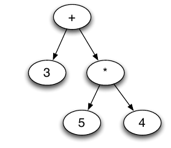

# Expression Tree

The intention of this project is to create a expression tree and evaluate the results but not parse input values.  Another stipulation was to build the project in such a way that was flexible and allowed for modifications to be fairly easy in the future. Because of this condition, you will see one of the design decisions was to use Kotlin's generics to allow for multiple data types. Due to using generics in this way, it required defining similar logic for various numeric types (int, long, etc). While this does add to the maintenance costs, it gives greater flexibility in the types allowed instead of relying on something like a double.

The project is using Kotlin as much as possible. The code and the Gradle file are both in Kotlin. This project is also using Github's Actions for CI, which just runs the tests.
